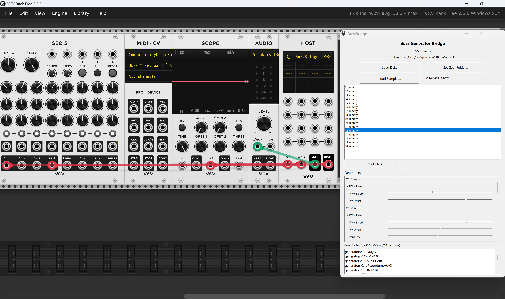

# BuzzBridge VST3




A VST3 wrapper that loads [Jeskola Buzz](https://jeskola.net/buzz/) machine DLLs and runs them inside any VST3-compatible DAW. Buzz machines are 32-bit plugin DLLs that represent virtual instruments and effects in the Buzz music tracker.

BuzzBridge exposes two VST3 plugins in a single bundle:

- **Buzz Generator Bridge** -- loads Buzz generator (instrument) DLLs
- **Buzz Effect Bridge** -- loads Buzz effect DLLs

Both 32-bit and 64-bit DAWs are supported. All Buzz machine parameters are mapped to automatable VST3 sliders with correct names, ranges, and defaults. MIDI note and CC input is fully supported.

## Requirements

- **Windows** (Buzz machines are Win32 DLLs)
- **Visual Studio 2022** with C++ desktop workload
- **CMake 3.25+**
- **Git** (for submodule checkout)
- **Inno Setup 6** (optional, for building the installer -- `choco install innosetup`)

## Build

```bash
git clone --recursive https://github.com/nstarke/JeskolaBuzzVST.git
cd JeskolaBuzzVST
```

If you already cloned without `--recursive`, initialize the VST3 SDK submodule:

```bash
git submodule update --init --recursive
```

### Quick build (both architectures)

```bat
build.bat
```

This builds everything in one step: 32-bit plugin, 32-bit bridge host, runs tests, builds the 64-bit plugin, and assembles the combined bundle in `dist/`.

### Manual build

```bash
# 32-bit build (direct-mode plugin + bridge host + tests)
cmake -B build32 -G "Visual Studio 17 2022" -A Win32
cmake --build build32 --config Release

# 64-bit build (bridge-mode plugin)
cmake -B build64 -G "Visual Studio 17 2022" -A x64
cmake --build build64 --config Release --target BuzzBridge
```

The 32-bit build must be done first because it produces `BuzzBridgeHost32.exe`, which the 64-bit plugin requires at runtime.

## Build Output

After a successful build, the combined VST3 bundle is at:

```
dist/BuzzBridge.vst3/
    Contents/
        x86-win/
            BuzzBridge.vst3          <-- 32-bit plugin (loads machines directly)
        x86_64-win/
            BuzzBridge.vst3          <-- 64-bit plugin (uses bridge)
            BuzzBridgeHost32.exe     <-- 32-bit bridge host (used by 64-bit plugin)
        Resources/
            moduleinfo.json
```

If building manually, the individual outputs are at:

```
build32/VST3/Release/BuzzBridge.vst3/Contents/x86-win/BuzzBridge.vst3
build32/bin/Release/BuzzBridgeHost32.exe
build64/VST3/Release/BuzzBridge.vst3/Contents/x86_64-win/BuzzBridge.vst3
```

## Building the Installer

The installer is built with [Inno Setup](https://jrsoftware.org/issetup.php). Install it first:

```bat
choco install innosetup --yes
```

Then, after a successful `build.bat` (which assembles the `dist/` folder), build the installer:

```bat
:: From Command Prompt (cmd):
"C:\Program Files (x86)\Inno Setup 6\ISCC.exe" /DMyAppVersion=v1.0.0 installer\BuzzBridge.iss

:: From PowerShell:
& "C:\Program Files (x86)\Inno Setup 6\ISCC.exe" "/DMyAppVersion=v1.0.0" installer\BuzzBridge.iss
```

This produces `dist\BuzzBridge-Setup-v1.0.0.exe`. The `build.bat` script will also build the installer automatically if Inno Setup is detected.

The `/DMyAppVersion=` flag sets the version shown in the installer and the output filename. Use any string you like for local builds.

## Installation

### From installer (recommended)

Download `BuzzBridge-Setup-vX.Y.Z.exe` from the [Releases](https://github.com/nstarke/JeskolaBuzzVST/releases) page and run it. The installer places the VST3 bundle in `C:\Program Files\Common Files\VST3\BuzzBridge.vst3\` and provides an uninstaller via Windows Add/Remove Programs.

### Manual installation

Copy the entire `BuzzBridge.vst3` folder (from `dist/` or assembled manually) to your VST3 plugin directory:

```
C:\Program Files\Common Files\VST3\
```

If you are using a **64-bit DAW** (most modern DAWs), make sure `BuzzBridgeHost32.exe` is in the same folder as the 64-bit `BuzzBridge.vst3` DLL (`Contents/x86_64-win/`). The 64-bit plugin looks for it there at runtime.

If you only need the **32-bit plugin** (for a 32-bit DAW), you only need the `x86-win/` folder and can skip the 64-bit build entirely.

## Running Tests

Tests run against the 32-bit build (where Buzz machine DLLs can be loaded directly):

```bash
cmake --build build32 --config Release --target BuzzBridgeTests
ctest --test-dir build32 -C Release --output-on-failure
```

Or run the test executable directly:

```bash
build32\bin\Release\BuzzBridgeTests.exe
```

The test suite includes 173 tests covering parameter layout, value mapping, oscillator tables, host callbacks, MIDI note/velocity/CC conversion, gear directory scanning, and integration tests that load real Buzz machine DLLs.

## Usage

1. Load **Buzz Generator Bridge** (as an instrument) or **Buzz Effect Bridge** (as an effect) in your DAW
2. Open the plugin editor -- click **"Load Buzz Machine..."** to browse for a Buzz machine DLL
3. The machine's parameters appear as automatable VST3 sliders
4. For generators, send MIDI notes to trigger sound -- velocity is automatically routed to the machine's volume parameter

## 64-bit Bridge Architecture

Buzz machine DLLs are 32-bit and cannot be loaded into a 64-bit process. BuzzBridge solves this with an out-of-process bridge:

```
64-bit DAW
  └─ BuzzBridge.vst3 (64-bit)
       │
       │ spawns on first use
       │
       └─ BuzzBridgeHost32.exe (32-bit child process)
            │
            └─ Buzz Machine DLL (32-bit)

  Communication:
    Named Pipe ──── commands, parameters, MIDI, state
    Shared Memory ─ audio buffers (zero-copy)
```

- The 64-bit plugin spawns `BuzzBridgeHost32.exe` as a hidden child process the first time a machine is loaded
- Commands (load DLL, tick, set parameters, MIDI events) are sent over a named pipe
- Audio data is transferred via shared memory for minimal latency
- The bridge host handles the 256-sample chunking required by Buzz machines internally
- If the bridge process crashes (due to a buggy machine), the DAW process is unaffected
- Each plugin instance gets its own bridge process and session

The 32-bit plugin variant loads Buzz machines directly in-process without the bridge, which has lower latency but requires a 32-bit DAW.

## MIDI Support

- **Note On/Off**: MIDI notes are converted to Buzz note format (`(octave << 4) | note`) and written to `pt_note` parameters. The machine's `MidiNote()` handler is also called directly.
- **Velocity**: MIDI velocity is automatically routed to the volume/velocity byte parameter adjacent to the note parameter, scaled to the parameter's range.
- **MIDI CC**: The controller implements `IMidiMapping`, mapping CCs sequentially to Buzz global parameters. DAWs can use this for MIDI Learn. CCs are also forwarded to machines that implement `CMachineInterfaceEx::MidiControlChange()`.
- **Poly Pressure / Aftertouch**: Routed to the machine's extended interface as aftertouch CC.

## Architecture

```
src/
  buzz/                         Buzz machine integration layer
    MachineInterface.h            Official Buzz SDK header (v66)
    BuzzMachineLoader.h/cpp       DLL loading and lifecycle
    BuzzCallbacks.h/cpp           CMICallbacks host stub
    BuzzOscTables.h/cpp           Bandlimited oscillator tables
    BuzzParamLayout.h/cpp         Packed parameter struct layout
  vst3/                         VST3 plugin layer
    BuzzProcessor.h/cpp           Base audio processor (tick timing, params, MIDI)
    GeneratorProcessor.h/cpp      Instrument variant (no input, stereo out)
    EffectProcessor.h/cpp         Effect variant (stereo in/out)
    BuzzController.h/cpp          Parameter controller + IMidiMapping
    BuzzPluginView.h/cpp          Native Win32 GUI (DLL file browser)
    ParameterMapping.h/cpp        Normalized <-> Buzz integer conversion
    BuzzPluginFactory.cpp         VST3 factory registration
  bridge/                       64-bit <-> 32-bit bridge
    BridgeIPC.h                   Shared memory + named pipe protocol
    BridgeClient.h/cpp            64-bit side: sends commands to host process
    BuzzBridgeHost32.cpp          32-bit host exe: loads machines, processes audio
  common/
    SEHGuard.h                    __try/__except crash protection
installer/                      Inno Setup installer script
tests/                          173 unit and integration tests
sdk/                            Steinberg VST3 SDK (git submodule)
```

## License

The Buzz machine interface header (`MachineInterface.h`) is Copyright (C) 1997-2014 Oskari Tammelin and may be used to write freeware machines for Buzz. The VST3 SDK is subject to the [Steinberg VST3 License](https://github.com/steinbergmedia/vst3sdk/blob/master/LICENSE.txt).
